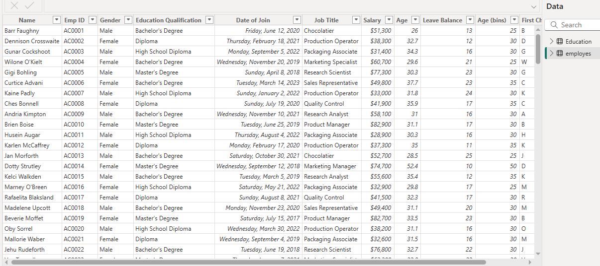
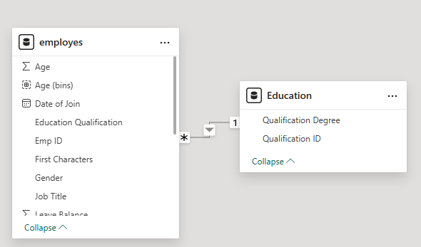
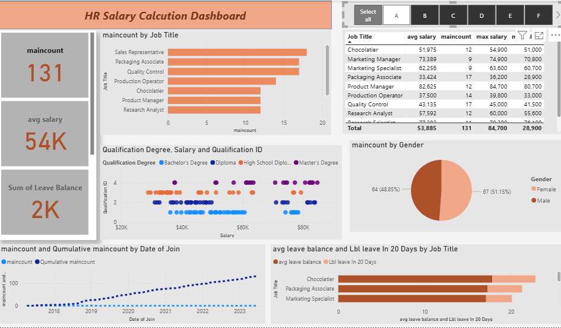
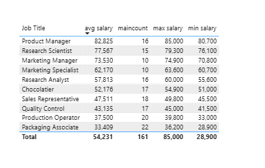
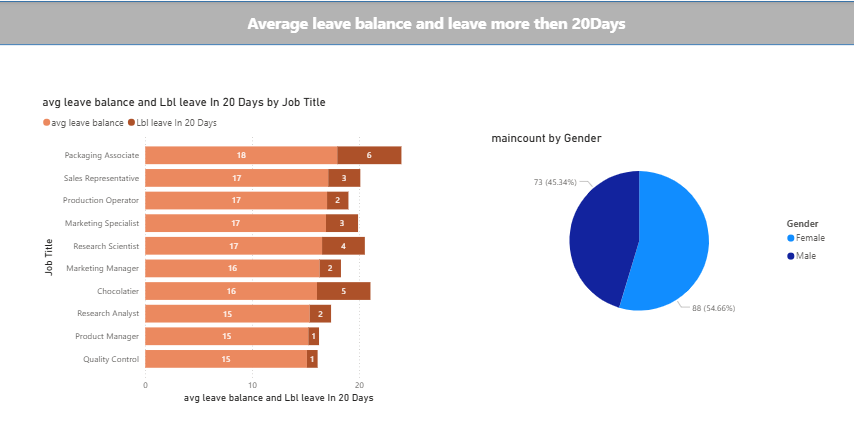

# 📊 HR Analytics Dashboard
An HR analytics dashboard that provides a clear overview of workforce data. It uses data visualization to display key metrics like employee demographics, salary trends, and staff growth, helping HR professionals make informed decisions.

## 🎯 Project Objective
The objective of this project is to analyze workforce data to uncover key HR insights, including employee demographics, salary distribution, staff growth trends, and leave balances. Using **Power BI, Excel, and DAX calculations**, the project transforms raw HR data into an interactive dashboard that supports data-driven decision-making in HR management.

---


---


---

## 📌 Project Requirements
The analysis addresses the following HR questions:
- How many people are in each job role?
- What is the gender breakdown of the staff?
- What is the age distribution across employees?
- Which jobs pay more, and who are the top earners in each role?
- How do qualifications impact salary levels?
- What is the staff growth trend over time?
- Can employees be filtered by the first letter of their name?
- What does the leave balance analysis reveal?
- How can HR managers track KPIs quickly in a **Quick HR Dashboard**?

---

## ⚙️ Key Features & Dashboard Insights
- 📌 **Job Role Analysis** – Distribution of employees across departments/roles.
- 📌 **Gender & Age Breakdown** – Diversity and workforce demographics.
- 📌 **Salary Insights** – Average salaries, top earners, and role-based salary comparison.
- 📌 **Employee Growth** – Cumulative staff count over time.
- 📌 **Qualification vs. Salary** – Relationship between education and pay.
- 📌 **Leave & Attendance Analysis** – Absenteeism and leave balance.
- 📌 **HR Dashboard** – A unified view of all critical KPIs.

---


---


---



---

## 🛠️ Tools & Technologies
- **Power BI** – Dashboard design & DAX calculations
- **Excel** – Data cleaning & PivotTables
- **DAX** – Custom HR measures & KPIs

---

## 📚 What I Learned from This Project
Through this project, I strengthened my:
- ✅ Ability to design **HR-focused dashboards** that answer real business questions.
- ✅ Skills in writing **DAX measures** for KPIs like cumulative employee count, absenteeism rate, and salary analysis.
- ✅ Knowledge of **data modeling and relationships** in Power BI.
- ✅ Use of **Excel PivotTables and formulas** for validation and quick checks.
- ✅ Understanding of how **analytics supports HR decision-making** (e.g., staff growth, salary fairness, diversity tracking).

---

## 🧮 Key DAX Measures

### Common HR KPIs
``` DAX
-- Total Employees
Total Employees = COUNTROWS(Employees)

-- Active Employees
Active Employees = CALCULATE(
    COUNTROWS(Employees),
    Employees[Status] = "Active"
)

-- Average Salary
Average Salary = AVERAGE(Salary[Salary Amount])

-- Absenteeism Rate
Absenteeism Rate = DIVIDE(
    COUNT(Attendance[Absent]),
    COUNT(Attendance[Date])
)

---

Cumulative Employee Count =
VAR currentdate = LASTDATE(Employees[Date of Join])
RETURN
    CALCULATE(
        [MainCount],
        ALL(Employees[Date of Join]),
        Employees[Date of Join] <= currentdate
    )

#####📌 Explanation:

- VAR currentdate = LASTDATE(Employees[Date of Join]) → Captures the most recent hire date in the current filter context.

- ALL(Employees[Date of Join]) → Removes filters to consider all dates.

- Employees[Date of Join] <= currentdate → Ensures only employees who joined on or before the current date are included.

